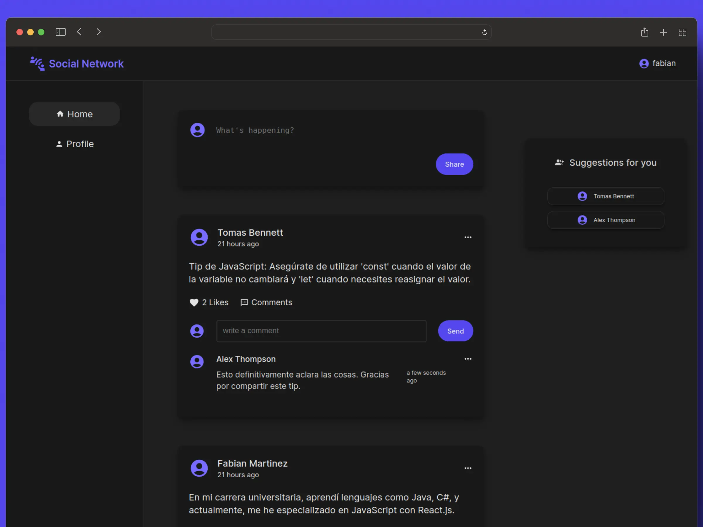

# Project Title: Social Network

 

## Video Demonstration

For a more visual overview, watch the project in action on the [Video Demonstration](https://www.youtube.com/watch?v=ffUWIax0hcg)

## Description

This FullStack application integrates Node.js, Express.js, MySQL, and React to provide users with a dynamic and secure social experience. Leveraging technologies such as JSON Web Token for authentication, bcryptjs for password encryption, and TanStack (React Query) for efficient data fetching.

## Technologies Used

- Node.js
- Express.js
- MySQL
- JSON Web Token
- bcryptjs
- React
- React Router
- TanStack (React Query)
- React Hook Form
- Axios
- CSS Modules

## Project Purpose

The primary objective of this project is to put the acquired knowledge into practice in React, Node.js, Express.js, and relational databases within a FullStack application.

## Features

- **User Registration:** Register users with a registration form that incorporates comprehensive validation checks.
- **User Authentication:** Enable users to log in securely using their credentials.
- **Post Sharing:** Sharing of posts within the platform.
- **Post Deletion:** Allow users to delete their own posts.
- **User Following:** Implement a feature to follow other users, showcasing their posts on the user's "Home" feed.
- **Like Posts:** Allows users to "Like" other users' posts.
- **Comments:** Allow users to comment on other users' posts.
- **Comment Deletion:** Provide the capability to delete user comments.
- **Profile Page:** Display user data and their respective posts on the profile page.
- **Profile Update:** Allow users to update their profile information, such as name, city, and contact email.
- **Logout:** Provide a secure logout option.
